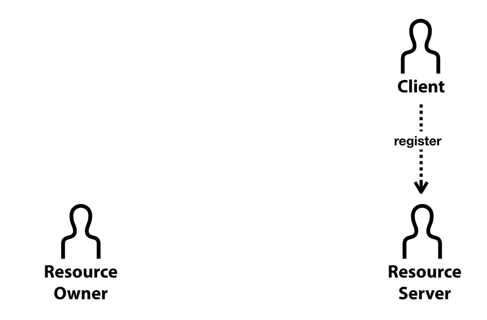
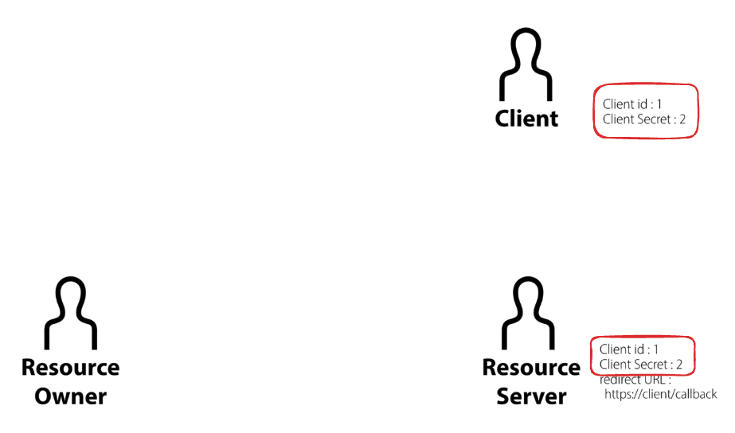
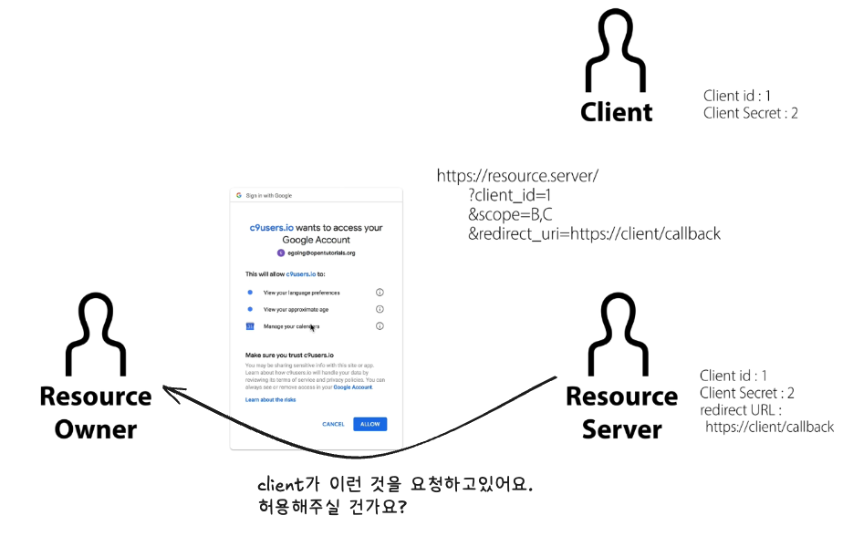
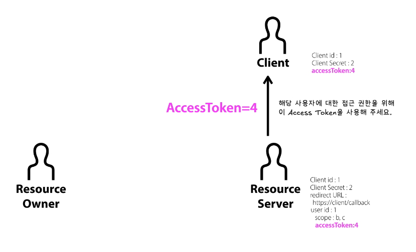

<aside>
💡

이고잉님의 [**WEb2-OAuth**](https://www.youtube.com/playlist?list=PLuHgQVnccGMA4guyznDlykFJh28_R08Q-) 강의를 보며 정리한 글입니다.

사진 자료는 해당 강의 영상의 자료를 캡처하여 위에 덧붙인 것입니다.

</aside>

## 1. OAuth의 개념

- `OAuth` 는 **Open Authorization** 의 약자로, 주로 사용자 정보를 보유한 서비스 (Google, kakao) 에서 인증과 권한을 위임하는 프로토콜입니다.
- `OAuth` 는 애플리케이션이 사용자 비밀번호나 민감한 정보를 요청하지 않고, 사용자로부터 특정 권한을 위임받아 작업을 수행할 수 있도록 합니다.

## 2. OAuth 역할

### Resource Owner (자원 소유자)

- 자원에 대한 접근 권한을 가진 사용자입니다.
- 예) Google Drive에 파일을 가진 실제 사용자

### Client (클라이언트)

- 자원 소유자를 대신해서 자원 서버에 접근하고자 하는 **애플리케이션**입니다.
- 예) 클라이언트 앱은 Google calender에 접근하여 일정을 등록할 수 있는 웹 애플리케이션일 수 있습니다.

### Resource Server (자원 서버)

- 우리가 제어하고자하는 실제 자원, 데이터를 가지고 제공하는 서버입니다.
- 예) Google Drive의 파일 저장 서버나, Google calender 서버가 이에 해당합니다.

### Authorization Server (인증 서버)

- 사용자의 신원을 확인하고 클라이언트가 자원에 접근할 수 있는 권한을 부여하는 서버입니다.
  - **Access Token**을 주는 곳이라고 생각하면 좋을 것 같습니다.
- 보통 자원을 제공하는 서비스 제공자가 직접 운영합니다.

### Access Token (접근 토큰)

- 클라이언트가 자원 서버에 접근할 수 있도록 권한을 부여 받으면 최종적으로 **Authorization Server**가 발급해주는 토큰입니다.
- 해당 토큰을 통해 클라이언트는 제한적으로 자원에 접근할 수 있습니다.

 

## OAuth의 절차 - 1. 등록

**Client** 서비스에서 **OAuth**를 제공하기 위해서는 우선 **Resource Server** 에 그에 대한 사전 승인을 받아야합니다. 이를 **“register”** 한다고 합니다.

 

---

 

**Resoure server** 마다 **OAuth**에 대한 승인 절차는 다르겠지만, 공통적으로 부여해주는 항목이 꼭 있습니다.

### **Client ID**

- 말그대로 **Client**를 구별하기 위해 있는 아이디입니다. 노출되어도 크게 상관없습니다.

### **Client Secret**

- Client 식별에 대한 비밀번호입니다. 절대 노출이 되어서는 안됩니다.
- **Resource Owner**로 부터 **OAuth** 인증을 허가하는데 중요한 역할을 합니다.

### **Authorized redirect URls**

- 권한을 부여하는 과정에서 **Authorized code**를 전달받을 주소입니다.
- 만약 **OAuth** 요청을 해당 주소를 통해 하지않고 다른 경로에 한다면, 요청을 무시당하게됩니다.
- **Client Secret** 와 함께 **Resource Owner**로 부터 **OAuth** 인증을 허가하는데 중요한 역할을 합니다.

 

## OAuth의 절차 - 2. Resource Owner의 승인

앞서 **Client**가 **Resource server**에 등록을 했기에,

**Client**와 **Resource Server**에는 각각 그에 관련된 정보가 저장되어있습니다.

---

 

승인 과정을 알아보기전,

만약 **Resource Server**에 존재하는[ A, B, C, D ]의 기능 중 [B, C] 의 기능만을 사용하고 싶다면 그 인증 범위 또한 지정을 해줄 수 있습니다.

이를 **scope**라고 합니다. 클라이언트가 접근할 수 있는 데이터와 권한의 범위를 라고 생각해주시면 될 것 같습니다.

 

---

 

**이제 Resource Owner의 승인 과정을 알아보겠습니다.**

만약, **Resource Owner**가 **Client** 에 있는 **외부 서비스**를 이용해야된다면,

위와 같이 **Client** 서비스는 **OAuth** 로그인 화면을 보여주게 됩니다.

 

---

 

해당 버튼들은 이러한 **url**로 이동하도록 설정되어있습니다.

여기에 **client_id, scope, redirect_uri** 가 명시되어있는 것을 볼 수 있습니다.

**register** 과정에서 보았던 것들인 것 같군요.

 

---

 

**Resource Owner**가 해당 버튼을 누른 후 일어나는 일은 **Resource Server**에 로그인 여부를 확인하는 것 입니다. 만일 로그인이 되어있지않으면 먼저 로그인을 하도록 합니다.

 

---

 

로그인에 성공을 한다면 이제 url에 있는 **client_id, redirect_uri** 와 기존 **client**의 **register** 과정에서 생성되었던 **client_id, redirect_uri** 을 비교합니다.

만일 둘 중 하나라도 다르다면 **Resource Server**는 해당 요청을 **거절**하게 됩니다.

 

---

 

**client_id**와 **redirect_uri**를 확인하고 일치한다면, 이제 **Resource Owner**에게 **Client**의 요청에 동의하는지에 대한 문구를 보여주게 됩니다.

 

---

 

**Resource Owner**가 자신의 정보를 특정 서비스에 제공하는 데 동의하면, **Resource Server**는 이 동의에 따라 **Resource Owner**의 허용 정보(사용자 ID 및 허용 범위인 scope)를 저장합니다. 여기서 **scope**는 클라이언트가 접근할 수 있는 데이터와 권한의 범위를 말합니다.

 

## OAuth의 절차 - 3. Resource Server의 승인

앞서 **Resource Owner**의 승인을 받았으니, 이제는 **Resource Server**의 승인이 필요한 상황입니다.

**Resource Server의 승인 절차는 다음과 같습니다. (상단의 그림과 함께 참고해 주세요!)**

1. **Resource Owner**가 서비스 제공에 동의하면, **Resource Server**는 `Authorization Code`라는 임시 인증 코드를 생성합니다.
2. 생성된 `Authorization Code`가 포함된 **URL**을 **HTTP 리다이렉트** 방식으로 **Resource** **Owner**를 자동으로 **Client**에 연결시킵니다.
3. 이를 통해 **Client**는 `Authorization Code`를 전달받을 수 있습니다.

이후 **Client**는 받은 `Authorization Code`와 함께 기존 인증 정보를 사용하여 **Resource Server**에 **Resource Owner**의 최종 인증을 요청합니다.

모든 인증 정보가 확인되면, **Resource Server**는 최종적으로 **Client**에게 **Access** **Token**을 발급합니다.

발급된 **Access Token**은 **Client**에 저장되며, **Client**는 필요할 때마다 이 **Access Token**을 사용하여 **Resource Server**에 요청을 보내고 리소스에 접근할 수 있습니다.

Resource Server는 이 Access Token을 통해 user id가 1인 사용자가 b와 c 권한에 대한 접근을 요청하고 있음을 확인할 수 있습니다.

 

## 마무리

OAuth는 다양한 서비스 간 안전한 인증과 권한 부여를 가능하게 하며, 특히 사용자의 민감한 정보를 보호하는 데 중요한 역할을 합니다.

이번 글을 통해 OAuth의 기본적인 흐름을 이해하고, 실제 인증 과정에서 어떤 일이 일어나는지 감을 잡으셨기를 바랍니다. 이후에는 Refresh Token, 토큰 만료와 갱신 등 더 깊은 OAuth 개념을 공부해 보시면 더욱 좋을 것 같습니다. :)
