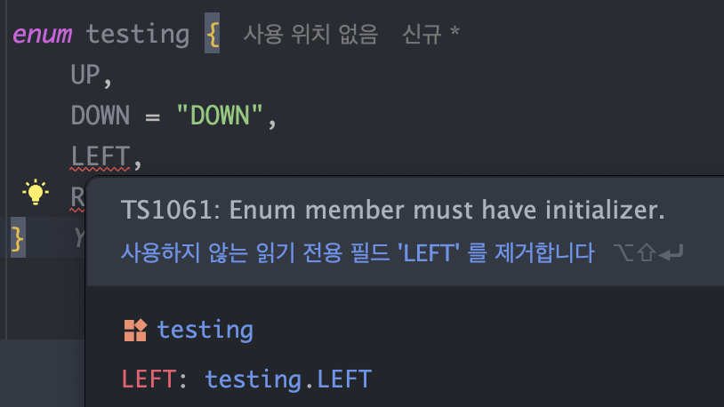

**TypeScript**로 개발을 하다 보면 비슷한 기능을 하는 여러 문법적 개념들을 마주치게 됩니다.

관련하여 많은 것들이 있지만, 이번 글에서는 `enum`, `const enum`, `as const`에 대해서 다뤄보려 합니다.

<br/>

```tsx
// enum을 사용한 방식
enum Status {
  PENDING = "PENDING",
  SUCCESS = "SUCCESS",
  ERROR = "ERROR",
}

//const enum을 사용한 방식
const enum Status {
  PENDING = "PENDING",
  SUCCESS = "SUCCESS",
  ERROR = "ERROR",
}

// as const를 사용한 방식
const STATUS = {
  PENDING: "PENDING",
  SUCCESS: "SUCCESS",
  ERROR: "ERROR",
} as const
```

`enum` 과 `as const` 는 **TypeScript**에서 상수를 선언할 때 사용하는 개념입니다.

<br/>

저는 근래 **“코드에 존재하는 반복되고 의미있는 문자열은 상수로 치환하라.”** 라는 말을 듣고 적극적으로 상수를 활용하였는데요.

이를 따르다 보면, 자연스럽게 위 3가지 방식 중 하나를 선택해야 하는 상황을 맞이하게 됩니다.

<br/>

하지만 돌이켜보면 선택하는 과정에서 명확한 근거없이 기분에 따라 사용을 했던 것 같습니다. (부끄럽네요..)

그래서 각각의 특징을 알아보며 스스로 컨벤션을 정해보려합니다.

앞으로 **TypeScript** 관련 글을 작성하게 된다면 이런 부류의 글을 몇개 더 작성할 것 같아요!

## enum

**TypeScript**의 `enum`은 열거형으로, 관련된 상수들의 집합을 정의하는 데 사용됩니다.

`enum`은 **JavaScript**에는 없는 **TypeScript**만의 기능인데요,

덕분에 **JavaScript** 언어로도 여러 상수 값을 하나의 네임스페이스 안에서 관리할 수 있게 되었습니다.

<br/>

### enum의 종류

**TypeScript**의 `enum`에는 크게 2가지 종류로 분류할 수 있습니다.

<br/>

### 1. 숫자형 enum

```tsx
enum Direction {
  Up, //0
  Down, //1
  Left, //2
  Right, //3
}
```

공식 문서에도 작성되어있는 대표적인 `숫자형 enum` 예시입니다.

이렇게 아무런 value 값을 부여하지 않으면, 자동으로 0부터 순차적으로 value 값이 할당됩니다.

```tsx
enum Direction {
  Up, //0
  Down = 5,
  Left, //6
  Right, //7
}
```

중간에 다른 숫자를 value로 할당하면, 이후는 해당 값 이후의 숫자가 자동으로 할당됩니다.

<br/>



단, 중간에 문자를 value로 할당할 경우, 이후의 key들은 자동으로 할당되지 않고 에러가 발생합니다.

<br/>

### 2. 문자열 enum

```tsx
enum Direction {
  Up = "UP",
  Down = "DOWN",
  Left = "LEFT",
  Right = "RIGHT",
}
```

`문자열 enum`은 말 그대로 문자열을 value 값으로 할당해준 것을 말합니다.

많은 분들이 `enum`을 사용하신다면 `문자열 enum`을 사용하시지않을까 생각이 드네요.

<br/>

## 컴파일 결과로 보는 차이점

`enum`을 숫자형과 문자열로 구분한 이유에는 다양한 이유가 있겠지만,

이 둘의 차이에서 가장 많이 거론되는 것은 바로 **JavaScript로** 컴파일 이후에 나타는 모습입니다.

<br/>

### 숫자형 enum 컴파일

우선 `숫자형 enum`의 컴파일 결과를 살펴보겠습니다.

```tsx
enum NumericEnum {
  A = 1,
  B = 2,
}

//컴파일 후

var NumericEnum
;(function (NumericEnum) {
  NumericEnum[(NumericEnum["A"] = 1)] = "A"
  NumericEnum[(NumericEnum["B"] = 2)] = "B"
})(NumericEnum || (NumericEnum = {}))
```

위 컴파일 후 **JavaScript** 코드에서 조금 이상한 형태로 객체 할당이 일어나는 것을 볼 수 있습니다.

```tsx
NumericEnum[(NumericEnum["A"] = 1)] = "A"
NumericEnum[(NumericEnum["B"] = 2)] = "B"
```

<br/>

조금 난해할 수 있을거라는 생각이 듭니다.

쉽게 이해하기 위해, `NumericEnum[NumericEnum["A"] = 1] = "A";` 부분을 도식화해보면 아래와 같습니다.

```tsx
// 1. 초기 상태
NumericEnum = {}

// 2. NumericEnum["A"] = 1
// "A" 프로퍼티에 1 할당
NumericEnum = {
  A: 1,
}

// 3. NumericEnum[1] = "A"
// 1을 키로 사용하여 "A" 할당
NumericEnum = {
  A: 1,
  "1": "A",
}
```

이로써 최종 생성되는 실제 객체 구조는 아래와 같습니다.

```tsx
{
    '1': 'A',
    '2': 'B',
    'A': 1,
    'B': 2
}
```

<br/>

처음 생성 의도인 `‘A’`에서 `1` 을 가져오는 것에 더불어 `‘1’`에서 `‘A’`을 가져올 수 있게 되었습니다.

```tsx
console.log(NumericEnum[1]) // 'A' (가능)
console.log(NumericEnum["A"]) // 1 (가능)
```

이를 **”역매핑(reverse mapping)"** 이라고 합니다.

`숫자형 enum`의 가장 큰 특징은 이 **역매핑**이 자동으로 생성된다는 점입니다.

하지만 **역매핑**이 자동으로 일어난다는건, **키-값 쌍이 두 배로 증가**한다는 말입니다.

그렇다면 당연히 메모리 사용률도 2배 증가할 것이고, **이는 큰 단점이라고 말할 수 있겠죠?**

<br/>

### 문자열 enum 컴파일

`enum`에는 아래와 같이 숫자형 말고 문자열을 할당하여 사용할 수도 있습니다.

그리고 `문자열 enum`은 역매핑이 발생하지 않고 **단방향 매핑**만 존재합니다.

```tsx
enum stringEnum {
    UP ="UP",
    DOWN = "DOWN"
}

-- 컴파일 후 --

var stringEnum;
(function (stringEnum) {
    stringEnum["UP"] = "UP";
    stringEnum["DOWN"] = "DOWN";
})(stringEnum || (stringEnum = {}));
```

역매핑을 지원하지 않는다는 것이 메모리 절약 측면에서는 장점으로 볼 수 있지만,

반대로 역매핑 원하는 상황이라면 단점으로 볼 수 있을 것 같습니다.

하지만 대개 `enum`을 역매핑을 염두에 두고 사용하는 일은 드물 것 같습니다. (개인적인 생각..)

<br/>

## enum의 장점과 단점

### 장점

**1. 가독성 향상**

enum을 사용함으로써 그룹화된 값들에 직관적인 네이밍을 할 수 있어 코드의 가독성이 향상됩니다.

덕분에 다른 사람이 나의 코드를 읽을 때 의도가 충분히 전달될 수 있습니다.

<br/>

**2. 의미있는 값으로 만들 수 있다.**

```tsx
enum StatusCode {
  OK = 200,
  CREATED = 201,
  ACCEPTED = 202,
}
```

그냥 `[200, 201, 202]` 로 작성될 수도 있는 요소들에게 각각 key값을 지정하여 의미있는 값으로 만들 수 있습니다.

<br/>

**3. key, value 값들에 대한 순회가 가능하다.**

```tsx
enum ResponseBodyMessages {
  SUCCESS = "요청 성공",
  CREATED = "리소스 생성 성공",
  NO_CONTENT = "요청 성공, 응답 데이터 없음",
}

console.log(Object.keys(ResponseBodyMessages)) // ['SUCCESS', 'CREATED', 'NO_CONTENT']
console.log(Object.values(ResponseBodyMessages)) // ['요청 성공', '리소스 생성 성공','요청 성공, 응답 데이터 없음']
```

`Object.keys()` 를 통해 enum의 key 값, `Object.values()` 를 통해 enum의 value 값들을 쉽게 순회할 수 있습니다.

<br/>

### 단점

**1. 일부 번들러에서 트리쉐이킹이 발생하지 않는다.**

> **트리 쉐이킹** 은 JavaScript 컨텍스트에서 일반적으로 사용되는 용어로, 쓸모없는 코드를 제거하는 것을 설명합니다.
>
> 출처 : https://developer.mozilla.org/en-US/docs/Glossary/Tree_shaking

<br/>

상단 예제에서 확인할 수 있듯, **TypeScript**의 `enum`은 **JavaScript**로 컴파일될 때 즉시 실행 함수(IIFE, Immediately Invoked Function Expression)로 변환됩니다.

```tsx
enum stringEnum {
    UP ="UP",
    DOWN = "DOWN"
}

-- 컴파일 후 --

var stringEnum;
(function (stringEnum) {
    stringEnum["UP"] = "UP";
    stringEnum["DOWN"] = "DOWN";
})(stringEnum || (stringEnum = {}));
```

이때 일부 **번들러**는 **즉시 실행 함수**를 단어 그대로, **“즉시 실행되는 함수”** 로 인식합니다.

즉, 사용되지 않는 코드라도 이를 쓸모없는 코드로 인식을 하지 못하게 되는 것입니다.

그래서 작성된 모든 `enum` 코드가 전혀 사용되지 않더라도 메모리에 남게됩니다.

(숫자형 `enum` 은 컴파일 후 2배의 메모리를 차지하겠군요.)

<br/>

하지만 최신 빌드 툴인 **vite**에서는 `enum`을 사용해도 **tree-shaking**이 잘 적용된다고 합니다.

<br/>

**2. 런타임 오버헤드**

`enum`은 TypeScript의 특수한 타입 시스템 기능으로 컴파일 후 자바스크립트에서 추가적인 코드가 생성됩니다.

이는 런타임 오버헤드를 유발할 수 있으며, 성능이 중요한 프로젝트에서 문제가 될 수 있습니다.

<br/>

**3. 숫자형 enum의 역매핑으로 인한 예기치 않은 순회 결과**

```tsx
enum StatusCode {
  OK = 200,
  CREATED = 201,
  ACCEPTED = 202,
}

console.log(Object.keys(StatusCode)) //['200', '201', '202', 'OK', 'CREATED', 'ACCEPTED']
console.log(Object.values(StatusCode)) //['OK', 'CREATED', 'ACCEPTED', 200, 201, 202]
```

앞서 언급한 숫자형 `enum`의 역매핑 기능이 추가되어 `Object.keys`, `Object.values` 사용 시 원하지 않는 결과를 얻게 됩니다.

사용 방식에 따라 유용할 수도 있겠지만, 해당 이유 때문에 숫자형 `enum`은 사용이 지양된다고 합니다.

<br/>

**4. 타입 확장의 어려움**

```tsx
enum BaseRole {
    USER = 'USER',
    ADMIN = 'ADMIN'
}

// 에러 발생
enum ExtendedRole extends BaseRole {
    SUPER_ADMIN = 'SUPER_ADMIN'
}
```

기본적으로 `enum`은 다른 `enum`을 확장할 수 없습니다.

---

## const enum

**TypeScript**가 초기 버전에서는 기본 `enum`만 제공했으나, 컴파일 성능과 코드 최적화를 위해 `const enum`이 후에 도입되었습니다.

`const enum`은 컴파일 후 자바스크립트 코드에 추가적인 객체가 생성되지 않고, 값이 인라인된다는 것이 큰 특징입니다. 이는 코드가 더 간결해지고 메모리 사용이 줄어들어 성능이 최적화됩니다.

<br/>

### const enum 컴파일 결과

```tsx
const enum Color {
  Red = "RED",
  Green = "GREEN",
  Blue = "BLUE",
}

const selectedColor = Color.Red
```

위 코드의 컴파일 결과는 다음과 같습니다.

```jsx
const selectedColor = "RED"
```

이처럼 `const enum`은 값이 인라인되고 트리 쉐이킹이 적용되므 메모리 사용량과 성능면에서 효율적입니다.

<br/>

### const enum 장점

**1. 인라인 확장**

`const enum`은 컴파일된 코드에서 실제 값으로 대체되므로 자바스크립트에 객체가 생성되지 않아 런타임 코드와 메모리 사용이 줄어듭니다.

<br/>

**2. 경량화된 코드**

`enum`이 즉시 실행 함수(IIFE)로 변환되는 것과 달리, `const enum`은 간결하게 변환되므로 런타임 오버헤드가 없습니다.

<br/>

### const enum 단점

**1. Isolated Modules에서 제한**

**TypeScript** 컴파일러 설정 중 `-isolatedModules` 옵션을 사용할 때 `const enum`은 오류를 발생시킬 수 있습니다. 이 옵션은 모듈을 개별적으로 컴파일하는데, 이 과정에서 `const enum`의 인라인 참조가 해석되지 않아 문제가 발생할 수 있습니다.

<br/>

**2. 외부 참조 제한**

`const enum`은 외부 모듈에서 참조할 때 제한이 있을 수 있습니다. 이는 컴파일 시 `const enum`이 인라인되기 때문에, 다른 모듈에서 참조할 때 제대로 해석되지 않아 오류가 발생할 수 있습니다.

<br/>

**const enum의 외부 참조 예시)**

파일 A (`enumModule.ts`)

```tsx
export const enum Color {
  Red = "RED",
  Green = "GREEN",
  Blue = "BLUE",
}
```

파일 B (`main.ts`)

```tsx
import { Color } from "./enumModule"

const selectedColor = Color.Red
console.log(selectedColor)
```

파일 B의 컴파일 결과

```jsx
const selectedColor = "RED"
console.log(selectedColor)
```

이처럼 `const enum`은 컴파일 시 값이 인라인되므로 실제 `Color` 객체가 생성되지 않습니다. 이로 인해 모듈이 개별적으로 컴파일될 때, `const enum` 참조가 올바르게 해석되지 않아 오류가 발생할 수 있습니다.

---

## as const

`as const`는 **타입스크립트에서 객체 리터럴의 값을 상수로 만들기** 위한 키워드입니다. 객체나 배열 리터럴에 `as const`를 사용하면 모든 프로퍼티가 읽기 전용(`readonly`)으로 간주됩니다.

<br/>

### as const 사용 예시

```tsx
const STATUS = {
  PENDING: "PENDING",
  SUCCESS: "SUCCESS",
  ERROR: "ERROR",
} as const

type StatusType = (typeof STATUS)[keyof typeof STATUS]
```

이 경우 `STATUS` 객체의 각 프로퍼티는 `"PENDING" | "SUCCESS" | "ERROR"`와 같은 리터럴 타입을 가지게 됩니다.

<br/>

### as const 장점

**1. 트리 쉐이킹**

`as const`를 사용하면 객체는 자바스크립트 코드로 변환될 때 즉시 실행 함수(IIFE) 없이 단순 객체 리터럴로 유지되므로 트리 쉐이킹에 유리합니다.

<br/>

**2. 타입 좁히기**

`as const`를 사용하면 `enum`과 같이 객체의 값이 `string`이나 `number` 타입으로 일반화되지 않고 구체적인 리터럴 타입으로 좁혀집니다.

<br/>

**3. 읽기 전용**

객체의 모든 프로퍼티가 `readonly`로 변환되어 불변성을 보장합니다.

<br/>

### as const 단점

**1. type 지정 필요**

`as const`로 선언된 객체를 타입으로 사용할 때, 값의 타입을 추출하기 위해 추가적인 타입 지정을 해주어야 합니다.

```tsx
type StatusType = (typeof STATUS)[keyof typeof STATUS]
```

이 과정은 코드가 덜 직관적으로 보일 수 있습니다. 이러한 추가적인 타입 지정이 필요하다는 점이 `as const`의 단점 중 하나입니다.

<br/>

**2. 순회 기능 제한**

기본적으로 `enum`처럼 `Object.keys()`를 사용하여 순회할 수 있는 기능이 제공되지 않습니다.

<br/>

## 결론

`enum`, `const enum`, 그리고 `as const`는 각각 고유의 장단점이 있는 **TypeScript** 기능입니다.

해당 글을 작성하면서 문자열에는 `enum`이, 숫자형에는 `const enum`이 가장 적합하다는 생각이 들었습니다.

하지만 동시에 이를 나의 컨벤션이라고 결정하는 것 또한 위험하다는 생각이 들었습니다.

비슷한 기능들이 미세하게 다른 특징을 갖는 이유는 다양한 프로젝트의 요구 사항에 더 적절히 대응할 수 있도록 하기 위함이라고 생각합니다.

앞으로 협업 중 컨벤션을 정해야 할 때, 해당 컨벤션을 정하는 날이 온다면 제가 적합하다고 생각하는 것을 **제안**은 하겠지만, 이를 바탕으로 다양한 토론을 해보고 싶네요!

## 참고

- https://yogjin.tistory.com/60
- https://xpectation.tistory.com/218
- https://techblog.woowahan.com/9804/
- https://blog.techeer.net/typescript-enum-타입-사용해도-될까-b73ea380d61d
