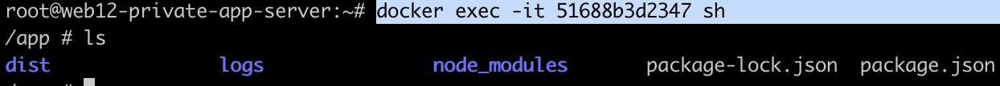
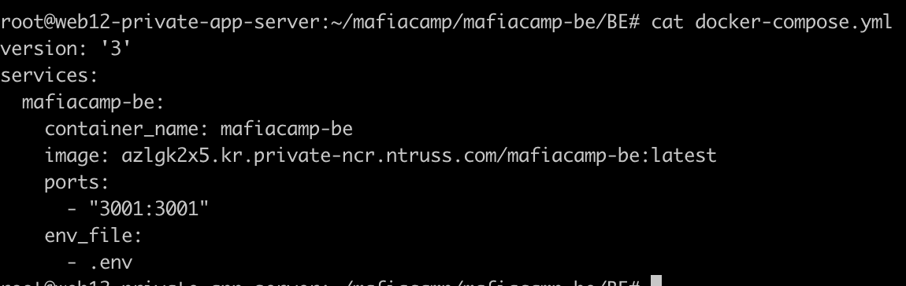
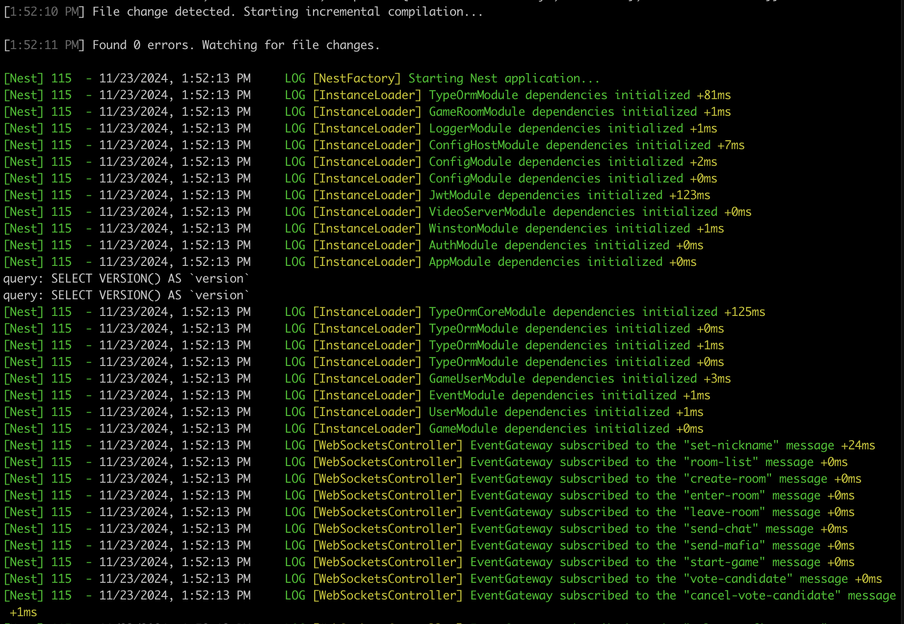

현재 제작중인 프로젝트인 [MafiaCamp](https://github.com/boostcampwm-2024/web12-MafiaCamp)에서 게임이 종료될 때 작동하는 openvidu 세션 종료 함수에서 서버를 터뜨리는 오류를 발견했습니다.

이를 해결하기 위해서는 서버에서 직접적으로 코드 수정하고 테스트해야 했지만, 저희 서버는 Docker 환경에서 실행되고 있었습니다.

이번 글에서는 MafiaCamp 프로젝트의 OpenVidu 관련 문제를 디버깅하기 위해 Docker 개발 환경을 설정하면서 겪은 시행착오와 배운 점을 공유하고자 합니다.

## 현재 환경 파악하기

### 1. Dockerfile 분석

아래는 프로젝트에서 사용 중인 `Dockerfile`입니다.

```tsx
# Build Stage
FROM node:20-alpine AS builder
WORKDIR /app
COPY package*.json ./
RUN npm install
COPY tsconfig*.json ./
COPY nest-cli.json ./
COPY src/ ./src/
RUN npm run build

# Production Stage
FROM node:20-alpine
WORKDIR /app
COPY --from=builder /app/dist ./dist
COPY --from=builder /app/node_modules ./node_modules
COPY package*.json ./
EXPOSE 3001
CMD ["npm", "run", "start:prod"]
```

해당 Dockerfile은 멀티 스테이지 빌드로 구성되어있어 2단계로 나눠볼 수 있을 것 같습니다.

- **Build Stage 단계** : TypeScript 소스 코드(`src/`)를 복사하고, 빌드 명령(`npm run build`)을 실행하여 JavaScript 파일을 생성하고, 결과물은 `dist` 폴더에 저장됩니다.
- **Production Stage 단계** : 빌드 단계(`AS builder`)에서 생성된 `dist` 폴더와 `node_modules`만 최종 이미지에 포함되고, `src` 폴더는 복사하지 않습니다.

이런 설정은 **이미지 크기를 최소화**하고 **보안을 강화**하는 데 유리하지만, 개발 환경에서 실시간 수정과 테스트에는 한계가 있습니다.

<br/>

### 2. 현재 서버 구성

현재 배포되어있는 서버 내 docker에는 `dist` 폴더만 포함되어있었습니다.



`dist` 폴더는 빌드된 JavaScript 코드이기에, 제가 해당 코드를 직접 수정하는 것은 불가능했습니다.

<br/>

## 서버의 최신 코드를 반영한 도커를 띄우려면?

현재 서버의 `docker-compose.yml`은 이미 빌드된 Docker 이미지를 참조하기 때문에, 소스 코드 변경 사항이 반영되지 않습니다.



저는 이 문제를 해결하기 위해 기존 환경에 영향을 주지 않으면서도 소스 코드 수정 사항을 반영할 수 있도록, **개발 전용 Docker Compose 파일**을 작성하기로 했습니다.

<br/>

## `docker-compose.override.yml` vs `docker-compose.dev.yml`

학습을 하면서 docker compose 파일명에서도 다양한 옵션이 있는 것을 확인할 수 있었습니다.

저는 그 중에 `docker-compose.override.yml` 와 `docker-compose.dev.yml` 의 차이는 무엇일지 궁금했습니다.

결론부터 말씀드리자면, `build` 명령어를 입력할 때, 명시적으로 파일 명 지정 여부에서 차이점이 나타납니다.

`docker-compose.override.yml` 의 경우는 `docker-compose.yml` 와 함께 **자동 병합**이 되기에, 추가 옵션을 지정하지 않아도 기본적으로 병합된 구성이 실행됩니다.

```bash
# docker-compose.yml과 docker-compose.override.yml이 병합되어 실행.
docker-compose up --build
```

<br/>

하지만 `docker-compose.dev.yml` 와 같이 커스텀 이름을 활용할 경우 명시적으로 파일을 지정해야하고 실행 시 -f 옵션으로 해당 파일을 지정해야합니다.

```bash
#docker-compose.yml과 docker-compose.dev.yml을 병합하여 실행.
docker-compose -f docker-compose.yml -f docker-compose.dev.yml up --build
```

<br/>

커스텀 이름의 장점은 환경별로 Docker Compose 파일을 구성할 수 있다는 점입니다.

```bash
docker-compose.dev.yml      # 개발 환경 전용 설정
docker-compose.prod.yml     # 프로덕션 환경 전용 설정
docker-compose.test.yml     # 테스트 환경 전용 설정
```

저의 목적은 개발 환경 전용 이미지 파일을 만드는 것이었고, 이미 CI/CD 과정에서 빌드된 파일이 `docker-compose.yml` 파일에 작성되어 최종 배포가 되는데, 자동으로 병합되는 `docker-compose.override.yml` 파일에 개발 환경을 구축하는 것은 그 규칙을 완전히 무시하는 꼴이 되는 것이었습니다.

더불어 추후 다양한 이미지 파일 구축을 확장하는데 도움이될 것 같아, 개발 환경 전용 `docker-compose.dev.yml` 파일을 만들기로 했습니다.

<br/>

## `docker-compose.dev.yml`

제가 최종적으로 작성하고 동작에 성공한 개발환경 compose 파일입니다.

```yaml
version: "3.8"
services:
  mafiacamp-be:
    build:
      context: .
      dockerfile: Dockerfile
    container_name: mafiacamp-be-dev
    ports:
      - "3001:3001"
    volumes:
      - ./src:/app/src
      - ./nest-cli.json:/app/nest-cli.json
      - ./tsconfig.json:/app/tsconfig.json
    command: ["sh", "-c", "npm install --include=dev && npm run start:dev"]
    environment:
      NODE_ENV: development
    env_file:
      - .env
```

물론 한번에 되진 않았겠죠..

제가 해당 파일을 만들기까지 마주했던 에러들을 하단에 정리해보겠습니다.

<br/>

### 1. Dockerfile 의 부재

`Docker Compose` 파일을 작성할 때, `build` 옵션을 사용하려면 반드시 `Dockerfile`이 필요합니다.

기존 `docker-compose.yml` 파일에 빌드된 내용이 있어 `Dockerfile`이 없을 줄 알았는데, `Dockerfile`이 없으면 이미지를 빌드할 수 없으므로 컨테이너 실행이 불가능하다고 합니다.

루트 부분에 `Dockerfile`을 생성해주었더니, 간단하게 해결되었습니다.

<br/>

### 2. Port 충돌 문제

```bash
ERROR: for mafiacamp-be-dev
Cannot start service mafiacamp-be: driver failed programming external connectivity on endpoint mafiacamp-be-dev
(e472ce6fa97934750394b4190a6d882152d89294e62f419ee32d72e1da6c32c8): Bind for 0.0.0.0:3001 failed: port is already allocated
```

Docker Compose를 실행할 때, `3001` 포트가 이미 다른 프로세스나 컨테이너에 의해 사용 중이라면 포트 충돌이 발생합니다.

해당 port 충돌 문제가 발생했을 때 확인해봐야할 것으로는 아래와 같습니다.

1. **docker 실행 목록 조회 후 중지**

```bash
docker ps
docker stop <CONTAINER_NAME_OR_ID>
```

2. **pid 번호를 통한 프로세스 종료시키기**

```bash
sudo lsof -i :3001
sudo kill -9 <PID>
```

3. **네트워크 제거하는 명령어 입력** (저는 해당 방식으로 해결했습니다.)

```bash
docker network prune
```

<br/>

### 3. EINVALIDTAGNAME

```bash
npm error code EINVALIDTAGNAME
npm error Invalid tag name "&&" of package "&&": Tags may not have any characters that encodeURIComponent encodes.
npm error A complete log of this run can be found in:
```

`npm`에서 `EINVALIDTAGNAME` 에러는 잘못된 형식의 패키지 이름 또는 태그 이름을 사용했을 때 발생합니다.

`Docker Compose`의 `command` 섹션에 명령어를 문자열로 작성했을 때, `&&`가 셸 명령으로 올바르게 해석되지 못하고 `npm`에서 패키지 이름으로 오해한 것이 원인입니다.

`docker-compose.dev.yml`의 `command` 부분을 배열 형식으로 변경하여 명령어를 명확히 전달함으로써 해결할 수 있었습니다.

**수정 이전**

```yaml
command: npm install --include=dev && npm run start:dev
```

**수정 이후**

```yaml
command: ["sh", "-c", "npm install --include=dev && npm run start:dev"]
```

<br/>

### 4. 'ContainerConfig’ 에러

```bash
Recreating mafiacamp-be-dev ...

ERROR: for mafiacamp-be-dev  'ContainerConfig'

ERROR: for mafiacamp-be  'ContainerConfig'
Traceback (most recent call last):
  File "/usr/bin/docker-compose", line 33, in <module>
    sys.exit(load_entry_point('docker-compose==1.29.2', 'console_scripts', 'docker-compose')())
  File "/usr/lib/python3/dist-packages/compose/cli/main.py", line 81, in main
```

**Docker Compose와 Docker Engine 간의 호환성 문제**로 인해 발생하는 에러였습니다.

저희 서버의 Docker Compose의 버전이 최신 Docker Engine과 호환되지 않아서 발생한 문제였습니다.

간단하게 업데이트해주어 해결할 수 있었습니다.

아래의 bash 명령어를 입력하여 업데이트를 해줌으로써 해결할 수 있었습니다.

```bash
sudo curl -L "https://github.com/docker/compose/releases/download/v2.27.0/docker-compose-$(uname -s)-$(uname -m)" -o /usr/local/bin/docker-compose
sudo chmod +x /usr/local/bin/docker-compose
```

<br/>

## 결과



결과적으로 Docker 개발 환경을 성공적으로 구축하였습니다.

상단 사진은 `docker-compose.dev.yml` 파일로 띄운 mafiacamp-be-dev 컨테이너가 실행되어있을 때의 로그인데, 서버의 코드를 변경하면 자동으로 배포 환경에 반영되어 바로바로 테스트해볼 수 있는 편한 환경을 갖출 수 있게 되었습니다.

Docker Compose와 Dockerfile을 제대로 활용하는 경험을 통해 Docker가 얼마나 강력한 도구인지 몸소 느낄 수 있는 시간이었습니다!
