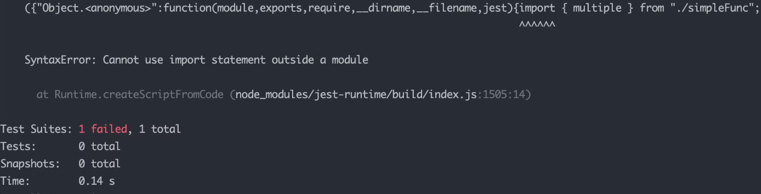

## **Jest 소개**


Jest는 Facebook에서 만들어져 React 프레임워크를 더불어 다양한 JavaScript 프로젝트에서 널리 사용되고 있습니다.

Jest는 다음과 같은 기능을 단일 패키지로 제공합니다:

- **Test Runner**: 테스트 파일을 찾아 실행하고 결과를 보고합니다.
- **Test Matcher**: 예상 결과와 실제 결과를 비교하는 함수들을 제공합니다.
- **Test Mock**: 함수나 모듈의 동작을 시뮬레이션하는 기능을 제공합니다.

이전에는 JavaScript 코드를 테스팅하는데 상단 기능들을 각기 다른 라이브러리에서 가져와 조합해서 사용했었지만, Jest가 이를 해결해주었다고 합니다.

그래서 Jest가 **“테스팅 프레임워크”**라고 불리기도 한답니다.

## Jest 설치 및 설정

1. **프로젝트 생성 :** 프로젝트 디렉터리를 생성하고 NPM 초기화 커맨드로 `package.json` 파일을 생성합니다.

   ```bash
   $ mkdir my-jest
   $ cd my-jest
   $ npm init -y
   ```

2. **Jest 설치 :** Jest 를 개발 의존성으로 설치합니다.

   ```bash
   npm install --save-dev jest
   ```

3. `package.json` 수정 : `test` 스크립트를 Jest를 실행하도록 수정합니다.

   ```json
   "scripts": {
     "test": "jest"
   },
   ```

   → 이로써 터미널에 `npm test`라고 입력하면 `jest` 커맨드를 실행할 수 있게 됩니다.

## ESM(ECMAScript Modules)과 Jest

Jest는 기본적으로 CommonJS 모듈 시스템을 사용합니다. 그러나 최근 JavaScript 생태계는 ESM을 선호하는 추세입니다. ESM은 정적 분석이 가능하고, 트리 쉐이킹과 같은 최적화를 지원하는 등의 장점이 존재하기 때문입니다.

ESM을 사용하려면 `package.json`에 다음 설정을 추가해야 합니다.

```json
{
  "type": "module"
}
```

하지만 이 설정만으로는 Jest를 사용하려하면 아래와 같은 오류를 마주할 수 있습니다.



해당 오류가 발생하는 이유를 찾아보니 Jest가 기본적으로 **CommonJS** 모듈 방식을 사용하기 때문에,
**ESM(ECMAScript Module)** 방식의 `import` 구문을 처리하지 못해서 발생하는 문제였습니다.

## Babel을 사용한 ESM 지원


Babel은 최신 JavaScript 코드를 이전 버전의 JavaScript로 변환(트랜스파일)하는 도구입니다. 이를 통해 최신 JavaScript 문법을 지원하지 않는 환경(예: 구형 브라우저)에서도 최신 문법을 사용할 수 있도록 해줍니다.

브라우저 호환성, 프로젝트 유지보수 측면에서 많은 도움을 주는 도구라고 할 수 있습니다.

Jest와 함께 Babel을 사용하면 ESM 문법을 Jest가 이해할 수 있는 형태로 변환할 수 있습니다. 이를 통해 최신 JavaScript 기능을 사용하면서도 Jest로 테스트를 수행할 수 있게 됩니다.

Babel 설정 과정은 다음과 같습니다.

1. **Babel 관련 패키지 설치**

   ```bash
   npm install --save-dev babel-jest @babel/core @babel/preset-env
   ```

2. **Babel 설정 :** 프로젝트 루트 하단에 `.babelrc` 파일을 생성하고 다음 내용을 추가합니다.

   ```json
   {
     "presets": ["@babel/preset-env"]
   }
   ```

   저같은 경우는 프로젝트 루트 하단에 이를 추가해두었습니다.

3. **Jest 설정**: 프로젝트 루트에 `jest.config.js` 파일을 생성하고 다음 내용을 추가합니다.

   ```jsx
   export default {
     transform: {
       "^.+\\.js$": "babel-jest",
     },
   }
   ```

   이 설정은 Jest가 Babel을 사용하여 `.js` 파일을 변환하도록 해준다고 합니다.

## 결론

많은 프로젝트들이 ESM으로 전환하고 있습니다. Jest와 같은 도구들도 이러한 변화에 적응하고 있지만, 아직은 추가 설정이 필요합니다.

Babel을 사용하여 Jest에서 ESM을 지원하도록 설정하면, 최신 JavaScript 문법을 사용하면서도 효과적으로 테스트를 수행할 수 있습니다.

설정이 다소 귀찮을 수도 있지만, 장기적으로 보면 이러한 설정이 프로젝트의 유지보수성과 확장성을 높이는 데 도움이 된다 생각합니다.
