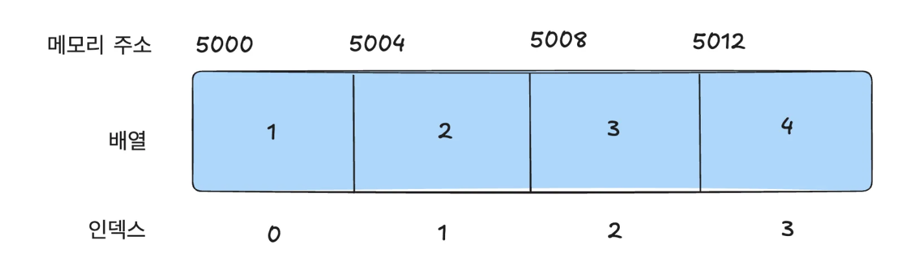

얼마 전에 재미있는 이야기를 들었습니다.

> _JavaScript의 배열 요소로는 문자, 숫자, 객체, 배열 심지어 함수까지 들어갈 수 있는데 어떻게 인덱스 접근 시간 복잡도 O(1)이 보장될까요?_

기존에 제가 알고 있는 배열 자료구조의 특성과 완전히 거리가 멀어 보였습니다.

배열이란 보통 동일한 타입의 데이터가 연속된 메모리 공간에 저장되어, 특정 인덱스로 빠르게 접근할 수 있는 구조라고 알고 있었기 때문입니다.

그런데 JavaScript의 배열은 다양한 타입의 요소들로 이루어져도 어떻게 배열의 기본적인 특징과 성능을 유지할 수 있는지 궁금해져 해당 주제로 글을 작성하게 되었습니다.

<br/>

## **O(1) 시간 복잡도의 의미와 중요성**

O(1) 시간 복잡도는 상수 시간을 의미하며, 입력 크기와 상관없이 항상 일정한 시간 내에 작업을 수행하는 것을 말합니다. 즉, 데이터의 양이 많아져도 총 실행 시간에 영향을 주지않는 것이 중요한 특징입니다. 실행 시간 제한이 있는 알고리즘을 문제를 해결하는 과정에서, 많은 분들이 O(1)의 소중함을 많이 느끼셨을 것 같습니다.

**배열의 인덱스 접근**은 O(1) 연산의 대표적인 예입니다. 배열이 효율적인 자료구조로 널리 사용되는 이유 중 하나는 바로 인덱스를 통한 빠른 접근입니다. O(1)의 중요성은 **빠르고 예측 가능한 성능을 제공**한다는 점에 있습니다. 입력 크기가 커지더라도 일정한 시간 내에 작업을 처리할 수 있으며, 다른 작업과 동시에 수행되더라도 일관된 성능을 보장합니다.

<br/>

## 일반적인 배열과 JavaScript 배열의 차이

### 일반적인 배열 구조 : **밀집 배열(Dense Array)**

자료구조(data structure)에서 흔히 말하는 배열은 동일한 크기의 메모리 공간이 연속적으로 나열된 자료구조를 말합니다. 이러한 배열을 흔히 **밀집 배열(Dense Array)** 이라고 합니다.

C/C++ 언어에서의 정적 배열 선언 코드로 이를 설명할 수 있습니다.

```cpp
int arr[4];
```



위 배열의 시작 주소를 5000이라고 가정하고 이를 시각적으로 표현해보면, 각 요소가 동일한 데이터 크기를 가지며 빈틈없이 연속적으로 나열되어 있습니다. 이러한 특성을 이용해 아래의 공식으로 특정 배열 요소에 빠르게 접근할 수 있습니다.

**_검색 대상 요소의 메모리 주소 = 배열의 메모리 시작 주소 + 인덱스 요소의 크기_**

이 공식 덕분에 밀집 배열에서는 **O(1)의 시간복잡도**로 요소를 접근할 수 있습니다.

- 인덱스가 2인 요소 = 5000 + 4 \* 2
- 인덱스가 3인 요소 = 5000 + 4 \* 3

이는 배열이 동일한 타입의 요소들로 구성되어 있기 때문에 가능한 것입니다.

<br/>

### JavaScript 배열의 구조

JavaScript의 배열은 위에서 설명한 일반적인 밀집 배열과는 다른 방식으로 동작합니다. JavaScript 배열은 다양한 타입의 요소를 담을 수 있으며, 각 요소의 메모리 크기가 달라도 상관이 없습니다.

```jsx
const arr = ["string", 1, true, NaN, [1, 2, 3], { a: 1 }]
```

이 배열에는 다양한 타입이 혼합되어있음에도 불구하고 이 배열의 인덱스 접근의 시간복잡도는 **O(1)** 입니다. 정말 신기하지 않나요?

이는 JavaScript 배열이 내부적으로 **숫자 인덱스를 가진 객체로 구현**되었기 때문에 가능하다고 합니다. 혹시 JavaScript 배열의 타입 을 출력해보신 적 있으신가요?

```jsx
const arr = []
console.log(typeof arr) //object
```

놀랍게도 배열의 타입은 `object`라고 출력이 됩니다.

**그렇습니다. JavaScript에는 배열이라는 타입이 따로 존재하지 않습니다.**

**JavaScript의 배열은 일반적인 배열의 동작을 흉내 낸 특수한 객체입니다.**

아래 코드를 살펴보겠습니다.

```jsx
const arr = []
arr[0] = 1
console.log(arr[0]) //1
console.log(arr["0"]) //1
```

`arr[0]` 과 `arr['0']` 이 동일한 출력을 합니다.

배열의 인덱스가 실제로는 객체에서 하나의 프로퍼티로 취급한다고 볼 수 있겠습니다.

신기하면서 약간 속은 것 같은 기분이 들기도 하네요.

`Object.getOwnPropertyDescriptors()` 를 통해 배열(객체)의 모든 속성에 대해 자세히 알아보겠습니다.

```jsx
const arr = [
  1,
  "string",
  false,
  function () {
    console.log("hi")
  },
]
console.log(Object.getOwnPropertyDescriptors(arr))

/*
{
  '0': { value: 1, writable: true, enumerable: true, configurable: true },
  '1': { value: 'string', writable: true, enumerable: true, configurable: true },
  '2': { value: false, writable: true, enumerable: true, configurable: true },
  '3': { value: [Function (anonymous)], writable: true, enumerable: true, configurable: true },
  length: { value: 4, writable: true, enumerable: false, configurable: false }
}
*/
```

이를 보고 아래와 같은 사실을 알 수 있겠군요.

- JavaScript의 배열은 인덱스를 문자열 형태로 프로퍼티로 키를 가진다.
- length라는 직접 할당하지 않은 특별한(?) 프로퍼티도 들어있다.
- 그리고 배열의 요소도 사실 인덱스의 프로퍼티이다.
  - 그래서 어떤 타입이던 배열의 요소가 될 수 있었던 것이다.

호기심이 발동하여 `console.log(arr['0'].value);` 해당 코드를 실행시켜보았지만, 다행히 `undefined`가 출력되었습니다. (요소가 출력되었으면 아마 혼란스러웠을 것 같아요.)

```jsx
console.log(arr["0"].value) //undefined

const descriptors = Object.getOwnPropertyDescriptors(arr)
console.log(descriptors["0"].value) // 1
```

<br/>

### JavaScript 배열의 희소 배열(Sparse Array)

JavaScript 배열은 일반적인 밀집 배열뿐만 아니라 **희소 배열(Sparse Array)** 의 특징도 가집니다.

여기서 **희소배열은** 배열의 일부 인덱스가 **비어 있는 상태**로, 요소들이 **연속적으로 채워져 있지 않은 배열**을 말합니다.

```jsx
const arr = [1, , 3, , 5]
```

배열을 선언한 문법이 참 이상해보이지만, JavaScript에서는 위와 같이 배열 선언이 가능합니다.

위의 배열 `arr` 는 인덱스 `1`과 `3`이 **비어 있는 상태**이며, JavaScript는 이 비어 있는 인덱스를 `undefined` 로 간주합니다.

다른 예제를 살펴보겠습니다.

해당 배열은 길이는 101이지만 실제로 요소가 할당된 인덱스는 `0,1,2,100` 총 4개입니다. 이는 해당 인덱스 외에는 메모리 공간이 할당되지 않음을 뜻합니다.

```jsx
const arr = [1, 2, 3]
arr[100] = "test"

console.log(arr.length) // 101

arr.forEach((value, index) => {
  console.log(`Index ${index}: ${value}`)
})

/*
Index 0: 1
Index 1: 2
Index 2: 3
Index 100: test
*/

console.log(Object.getOwnPropertyDescriptors(arr))

/*{
  '0': { value: 1, writable: true, enumerable: true, configurable: true },
  '1': { value: 2, writable: true, enumerable: true, configurable: true },
  '2': { value: 3, writable: true, enumerable: true, configurable: true },
  '100': { value: 'test', writable: true, enumerable: true, configurable: true},
  length: { value: 101, writable: true, enumerable: false, configurable: false}
}*/
```

이러한 배열의 인덱스 할당이 가능한 이유는 JavaScript 배열이 근본적으로 객체이기 때문입니다. 배열의 인덱스는 객체의 **프로퍼티 키**처럼 동작하며, 인덱스를 지정해 값을 할당하면 **해당 인덱스에 프로퍼티가 추가되는 형태**로 동작합니다. 더불어 `length` 프로퍼티도 자동으로 갱신됩니다.

희소배열은 위와 같이 연속된 데이터 관리가 이루어지지않습니다. 이는 JavaScript 엔진 입장에서 **밀집 배열에 비해 최적화된 메모리 접근이 어려워지고**, 인덱스 접근이 **비효율적이 될 가능성**이 크며, **인덱스 접근 시 O(1)을 보장하지 못하는 경우가 발생할 수 있습니다.**

따라서 **배열을 사용할 때는 가능하다면 밀집 배열 형태를 유지하는 것이 성능 면에서 유리**합니다.

<br/>

## 밀집 배열 vs 희소 배열 : 성능 비교

JavaScript 배열의 성능은 밀집 배열인지 희소 배열인지에 따라 크게 달라질 수 있습니다.

밀집 배열에서는 일반적인 배열처럼 **O(1)** 의 성능을 보장할 수 있지만, 희소 배열의 경우 인덱스 접근 시 객체의 프로퍼티 조회와 유사하게 동작하기 때문에 성능 저하가 발생할 수 있습니다.

하단 코드를 통해 밀집 배열과 희소 배열의 요소 접근 시간과 요소 삭제 시간의 성능 차이를 간단한 실험을 통해 비교해 보겠습니다.

**실험 목적**

- **배열의 요소 접근 시간**을 비교하여 밀집 배열과 희소 배열의 성능 차이를 확인
- **배열 요소 삭제 시간**을 비교하여 두 배열의 동작 방식이 성능에 어떤 영향을 미치는지 확인

**실험 코드**

```jsx
// 밀집 배열(Dense Array) 실험
console.log("밀집 배열 실험 시작");
let denseArray = [];
for (let i = 0; i < 1000000; i++) {
    denseArray.push(i);
}

console.time("밀집 배열 접근 시간");
for (let i = 0; i < 1000000; i++) {
    let value = denseArray[i];  // 모든 요소에 접근
}
console.timeEnd("밀집 배열 접근 시간");

console.time("밀집 배열 중간 요소 삭제 시간");
denseArray.splice(500000, 1);  // 배열 중간에서 요소 하나 삭제
console.timeEnd("밀집 배열 중간 요소 삭제 시간");

// 희소 배열(Sparse Array) 실험
console.log("\n희소 배열 실험 시작");
let sparseArray = [];
for (let i = 0; i < 1000000; i += **할당 간격**) {
    sparseArray[i] = i;
}

console.time("희소 배열 접근 시간");
for (let i = 0; i < 1000000; i++) {
    let value = sparseArray[i];
}
console.timeEnd("희소 배열 접근 시간");

console.time("희소 배열 중간 요소 삭제 시간");
delete sparseArray[500000];  // 배열 중간에서 요소 하나 삭제
console.timeEnd("희소 배열 중간 요소 삭제 시간");
```

해당 실험의 **핵심 부분**은 희소 배열(Sparse Array)의 요소를 할당하는 **간격**입니다.

```jsx
for (let i = 0; i < 1000000; i += **할당 간격**) {
    sparseArray[i] = i;
}
```

**실험 결과**

**`할당 간격 = 10`**

```
밀집 배열 실험 시작
밀집 배열 접근 시간: 1.222ms
밀집 배열 중간 요소 삭제 시간: 0.084ms

희소 배열 실험 시작
희소 배열 접근 시간: 1.254ms
희소 배열 중간 요소 삭제 시간: 0.002ms
```

<br/>

**`할당 간격 = 11`**

```
밀집 배열 실험 시작
밀집 배열 접근 시간: 1.435ms
밀집 배열 중간 요소 삭제 시간: 0.09ms

희소 배열 실험 시작
희소 배열 접근 시간: 1.124ms
희소 배열 중간 요소 삭제 시간: 0.002ms
```

<br/>

**`할당 간격 = 12`**

```
밀집 배열 실험 시작
밀집 배열 접근 시간: 1.153ms
밀집 배열 중간 요소 삭제 시간: 0.075ms

희소 배열 실험 시작
희소 배열 접근 시간: 33.362ms -> 갑자기 증가한 모습
희소 배열 중간 요소 삭제 시간: 0.002ms
```

<br/>

**`할당 간격 = 100`**

```
밀집 배열 실험 시작
밀집 배열 접근 시간: 1.205ms
밀집 배열 중간 요소 삭제 시간: 0.133ms

희소 배열 실험 시작
희소 배열 접근 시간: 32.288ms
희소 배열 중간 요소 삭제 시간: 0.003ms
```

**결과 분석**

- `할당 간격 = 11` 까지는 오히려 희소 배열 접근 시간이 밀집 배열 접근 시간보다 적은 시간이 걸렸습니다.
- `핵심 부분 = 12` 를 기준으로 희소 배열 접근 시간이 크게 증가함을 볼 수 있었습니다. (12 이상 숫자는 대부분 비슷한 측정 시간이었습니다.)
  - 이는 JavaScript 엔진이 해당 지점부터 희소 배열을 밀집 배열로 최적화하지 않고 일반 객체처럼 처리해서 나타나는 현상일 가능성이 높아보입니다.
- 밀집 배열의 접근 시간은 대게 동일한 시간이 측정되었습니다.
- 더불어 중간 요소 삭제 시간은 객체로 처리된 희소 배열에서 더 적은 시간을 보여주었습니다.

밀집 배열은 항상 빠른 접근 성능을 제공하지만, 희소 배열은 할당 간격이 일정 수준을 초과하면 성능이 급격히 저하되는 것을 확인할 수 있었습니다.

**이는 JavaScript 엔진이 배열을 밀집 형태로 최적화할 수 없을 때, 객체와 같은 방식으로 배열을 처리하기 때문입니다.**

여기서 얻을 수 있는 가장 중요한 사실은, JavaScript 배열이 O(1) 성능을 보장할 수 있는 조건은 배열이 밀집된 형태로 요소를 관리하는 경우라는 것입니다.

희소 배열이나 타입이 혼합된 배열에서는 JavaScript 배열이 일반 객체처럼 동작하여 성능 저하가 발생할 수 밖에 없습니다.

<br/>

## JavaScript 엔진의 최적화와 배열

앞서 **밀집 배열**과 **희소 배열**의 성능 비교 실험을 통해 배열의 형태에 따라 성능이 크게 달라질 수 있음을 확인했습니다.

**JavaScript 엔진은 밀집 배열을 최대한 유지하려고 합니다.** 그 이유는 밀집 배열이 **빠른 인덱스 접근, 캐시 효율성, 그리고 최적화 용이성** 측면에서 희소 배열보다 더 나은 성능을 제공하기 때문입니다. 이는 최적화하는 엔진의 입장에서도, 이를 사용하는 사용자 입장에서도 장점이 됩니다.

밀집 배열과 희소 배열의 구분 이외에도 JavaScript 엔진은 배열을 처리하고 최적화하는 다양한 과정을 거칩니다. 이제 엔진이 배열을 어떻게 최적화하고 효율적으로 관리하는지에 대해 살펴보겠습니다.

<br/>

### **1. JavaScript 배열의 참조 기반 요소 저장**

JavaScript 배열은 일반적인 C/C++의 배열과는 달리, 배열의 각 요소가 **참조(reference)** 로 저장됩니다. 이는 배열 요소들이 다양한 타입(숫자, 문자열, 객체 등)으로 구성될 수 있기 때문에, 각 요소가 실제 값을 직접 저장하는 방식을 사용하지 않고 **메모리 위치에 대한 참조를** 저장하는 방식을 사용하는 의미입니다.

인덱스 요소로 **참조**를 저장하기에 배열 요소의 크기는 모든 인덱스에서 동일하게 취급됩니다. 그래서 배열의 내부에서는 다양한 타입의 요소들이 있더라도, **인덱스마다 필요한 저장 공간**은 동일합니다.

이러한 구조 덕분에 배열의 요소가 다양한 타입으로 섞여 있어도, 배열의 시작 주소와 인덱스를 이용해 해당 참조에 접근함으로써 일정한 시간 내에 배열 요소를 조회할 수 있습니다.

<br/>

### **2.`Elements Kinds` 를 이용한 최적화**

V8 엔진은 배열의 요소들을 관리하기 위해 **Elements Kinds**라는 개념을 사용합니다.

이는 배열의 모든 요소들이 모두 동일한 타입인지, 다양한 타입이 섞여 있는지를 기준으로 배열을 **최적화된 형태로 관리**하는 방식입니다.

V8 엔진에서 사용되는 몇 가지 **Elements Kinds**는 다음과 같습니다.

- **PACKED_SMI_ELEMENTS**: 모든 요소가 작은 정수(Small Integer)인 경우 최적화된 형태.

  ```jsx
  let smiArray = [1, 2, 3, 4, 5]
  ```

- **PACKED_DOUBLE_ELEMENTS**: 모든 요소가 부동 소수점 숫자인 경우.

  ```jsx
  let doubleArray = [1.1, 2.2, 3.3, 4.4, 5.5]
  ```

- **PACKED_ELEMENTS**: 혼합된 타입의 요소를 포함하는 경우.

  ```jsx
  let mixedArray = [1, "two", { three: 3 }]
  ```

- **HOLEY_SMI_ELEMENTS**: 위의 각 타입에 대해, 중간에 빈 요소가 있는 경우.

  ```jsx
  let holeySmiArray = [1, , 3, , 5]
  ```

이렇게 V8엔진은 배열의 모든 요소 확인한 후 나름대로 **최척화 스탠스**를 정합니다.

각각 **Elements Kinds**는 배열의 요소 타입에 맞게 최적화하여, 특정 상황에서는 더 빠른 메모리 접근이 가능하게 만들어줍니다.

<br/>

### 3. 다양한 타입의 배열과 동적 최적화

JavaScript 배열은 여러 타입의 요소를 가질 수 있지만, 엔진은 배열의 요소 타입을 가능한 일관되게 유지하려고 합니다. 배열의 요소 타입이 일관된 경우 **더 높은 수준의 최적화**를 적용할 수 있기 때문입니다.

그러나 배열 내에 다양한 요소가 존재하여 더 이상 하나의 타입으로 처리할 수 없는 경우, JavaScript 엔진은 배열의 내부 구조를 **일반적인 객체 형태**로 전환하게 됩니다.

이 과정에서 메모리 관리와 최적화가 다시 적용되어, 배열의 관리 방식을 더 유연한 형태로 조정합니다. 이러한 변화는 엔진의 최적화 수준이 낮아짐을 의미하며, 더 이상 연속된 메모리 블록으로 효율적으로 관리되지 않을 수 있습니다.

추가로 이 과정에서 **V8**은 **히든 클래스(Hidden Class)** 라는 내부 구조를 사용합니다. 히든 클래스는 배열이나 객체의 속성에 대한 **메모리 레이아웃을 최적화**하여, 엔진이 이러한 속성들에 빠르게 접근할 수 있도록 돕습니다.

히든클래스에 대해 더 알아보시고 싶으신 분은 해당 글을 참고해보시면 좋을 것 같습니다.

→ https://engineering.linecorp.com/ko/blog/v8-hidden-class

이러한 내부 최적화 덕분에 JavaScript는 배열에 여러 타입의 요소가 존재함에도 불구하고, 인덱스를 통한 접근이 **O(1)** 시간복잡도로 이루어질 수 있습니다.

<br/>

## **인덱스 접근, O(1) 보장하기 위해**

개인적으로 배열의 인덱스 접근의 시간복잡도가 O(1)이 보장되지 않는다면 굳이 배열을 사용할 필요가 없다고 생각합니다. 배열의 주요 장점은 가장 빠르게 요소 접근이 가능하다는 점이기 때문입니다.

그래서 제 나름대로 항상 **O(1)의 성능을 유지하기 위해서 배열을 어떻게 다뤄야할지** 나름의 다짐(?)해보았습니다.

1. **하나의 타입으로 배열을 구성하기** : 최적화된 Elements Kind를 할당 받으려 노력하자.
2. **밀집 배열 유지하기(희소 배열 사용 지양하기)** : 배열의 빈공간은 최적화하는 JavaScript 엔진의 입장에서 꽤나 방해요소일테다.
3. **배열 크기 미리 할당하기 :** 동적으로 배열이 커지는 상황에서 발생할 수 있는 새로운 메모리를 할당하는 상황을 만들지 않도록 하자.
4. **불필요한 배열 재구성하지 않기** : 배열의 요소 타입을 빈번하게 변경하거나, 배열 내에 다른 객체나 배열을 추가하면 엔진이 기존의 **Elements Kind**를 폐기하고 새로운 형태로 배열을 재구성하기에 이 점을 유의하도록 하자.

## 참고

- **모던 자바스크립트 Deep Dive**
- https://devkly.com/nodejs/javascript-array/
- https://engineering.linecorp.com/ko/blog/v8-hidden-class
