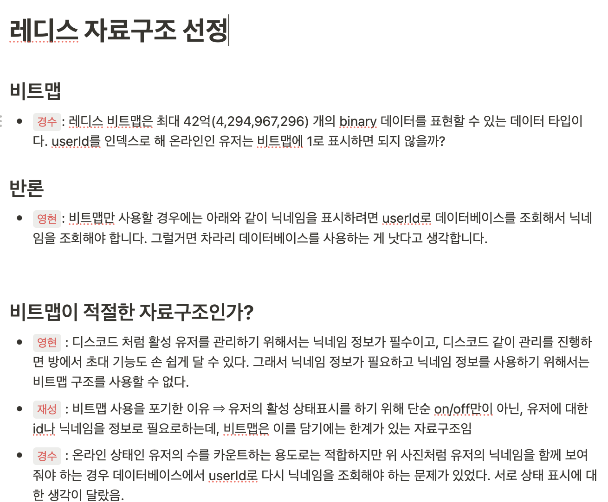
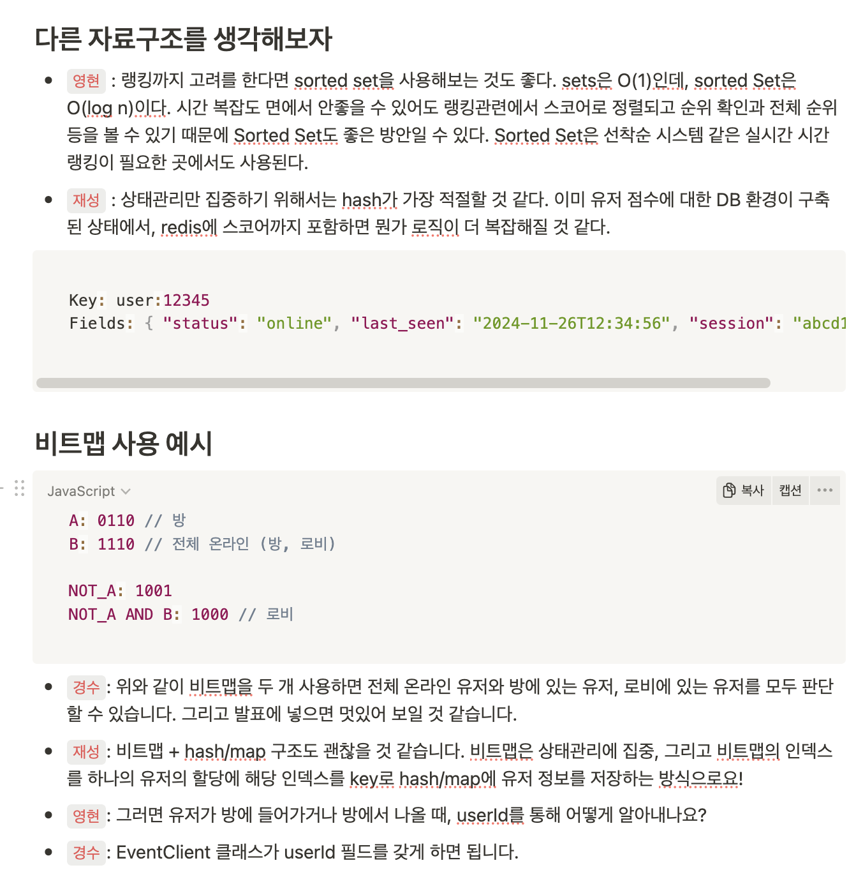
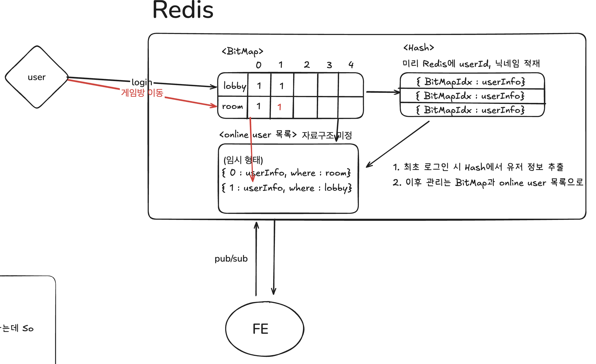
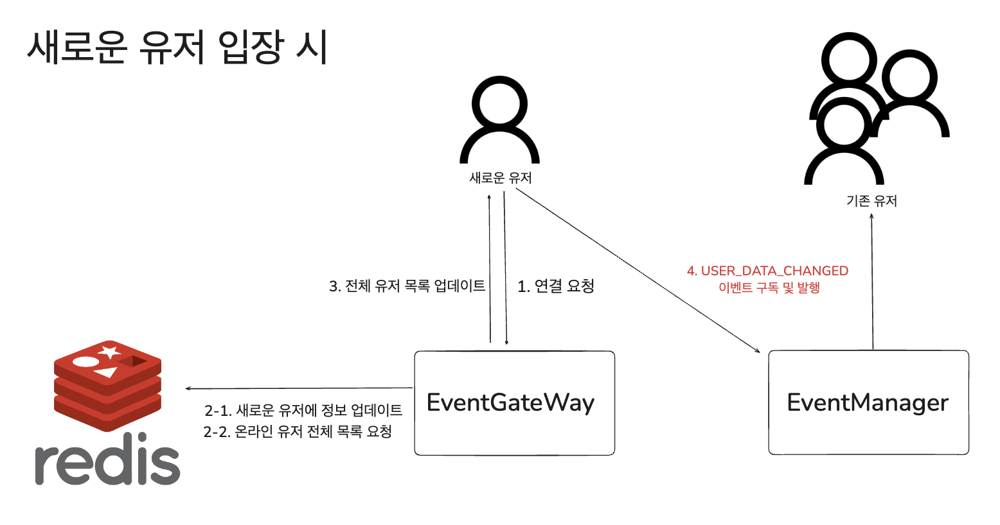

## 자료구조 선택과 고민

저희 12팀에서 백엔드를 담당하는 저를 비롯하여 영현님, 경수님과 함께 **유저 온라인 상태 관리**를 같이 구현하기로 하였습니다.





긴 시간동안 여러 자료구조에 대한 고민을 통해,

**우선 1차로는 `Bitmap` + `Hash` 구조를 통해 접속된 유저에 대한 정보를 저장하자고 정했습니다.**

<br/>

각 자료구조의 역할은 아래와 같습니다.

1. 비트맵 (Bitmap)

- 역할: 각 유저의 상태(로비/게임방/오프라인)를 최소한의 메모리로 효율적으로 기록
- 구조: 두 개의 비트맵을 사용하여 로비와 게임방 상태를 각각 기록

2. 해시 (Hash)

- 역할: 유저의 상세 정보(닉네임, ID 등)를 빠르게 조회
- 구조: `user_id`를 키로 사용하고, 관련 유저 정보를 값으로 저장

<br/>

**Bitmap을 사용하는 이유는 아래와 같습니다.**

- 메모리 효율성: 비트를 사용하여 최소한의 메모리로 다수의 유저 상태를 관리할 수 있습니다.
- 빠른 연산: 비트 연산을 통해 유저의 상태를 신속하게 판별할 수 있습니다.
- 비트맵 사용 사례
  - `A = 로비`, `B = 게임방`일 때:
    - `A && B === 1`: 게임방에 있음.
    - `(A || B === 1) && (A && !B === 1)`: 로비에 있음.
    - `(A || B === 0)`: 오프라인.

하지만 제가 판단하기에는 2개의 구조로 이를 관리한다면 새로운 유저가 입장할 때는 무엇을 전해줄 것인가? 였습니다.

기존에 있던 유저에게는 상태가 변한 유저에대한 정보를 주고 이것만 업데이트하면되지만, 새로 들어온 유저에게는 현재 방 상태에 대한 정보를 다시 수집하고 줘야하기에 현재 온라인인 유저에 대해 순차탐색 + 비트연산이 필수라는 생각이 들었기 때문입니다.

**그래서 저는 현재 온라인 상태인 유저들을 보관하는 자료구조가 하나 더 필요하다는 생각이 들었습니다.**

하지만 너무 과하게 자료구조를 사용하는게 아닌가? 라는 딜레마에 빠졌습니다.

그래도 현재 마음이 이 3개의 구조를 혼합하는 거에 끌리기에 한번 도전해보기로 했습니다.

<br/>

## 1차 기획에 대한 구조



대략적인 구조는 위와 같습니다.

2개의 **`Bitmap`**, 2개의 `Hash`로 구성되어있는 다소 복잡한 구조입니다.

**1. lobby 존재 여부 판단을 위한 `Bitmap` & room 입장 여부 판단을 위한 `Bitmap`**

`Bitmap`을 2개 둔 이유는 유저가 현재 위치한 곳을 적은 메모리인 비트를 기반으로 비트 연산을 통해 쉽게 판별하기 위함입니다.

```tsx
A(lobby) , B(room) 일 때

A && B === 1 : 게임 방에 위치
(A || B === 1) && (A && !B === 1) : 로비에 위치
(A || B === 0) && (A && B === 0) : 오프라인
(A || B === 1) && (!A && B === 1) : 로비에는 없지만, 룸에는 있는 상황 : 오류
```

<br/>

**2. user의 정보를 빠르게 조회하기 위한 Redis 내부의 `Hash`**

저희 DB에 있는 user 테이블을 그대로 옮겨놓기 위한 Hash 자료구조입니다.

현재 접속한 유저에 대한 정보를 Redis 내부에 관리하면서 빠르게 접근하여 관리하기 위함입니다.

현재 user는 `user_id` 를 고유하게 갖는데, 이를 key값으로 user의 정보를 저장하지않을까 싶습니다.

```sql
CREATE TABLE user(
    user_id bigint auto_increment primary key,
    email varchar(30) not null,
    nickname varchar(50) not null,
    password varchar(255) null,
    oauth_id varchar(100) not null,
    score int not null,
    created_at datetime not null
);
```

더불어 `user_id` 를 BitMap의 Index로도 활용할 예정입니다.

<br/>

**3. 전체 online user 목록을 관리하기 위한 `Hash`**

말그대로 online user를 관리하기 위한 자료구조입니다.

앞서 언급했 듯, 이를 추가한 이유는 새로운 유저가 연결되었을 때 유저의 상태를 살펴볼 필요가 없이 바로 전달해줄 걸 만들어 놓기 위함입니다.

<br/>

### 1차 기획에 상황에 대한 플로우

**1. 새로운 유저가 입장할 때**

1. `userInfo`에 유저 정보 업데이트
2. `inLobby` 비트맵에서 해당 유저의 비트를 설정
3. `onlineUser`에 유저 상태 추가

**2. 유저가 방에 들어가면**

1. `inRoom` 비트맵에서 해당 유저의 비트를 설정
2. 비트맵 연산을 통해 유저의 위치 업데이트
3. 비트맵 연산을 통해 `onlineUser` 에 해당 유저의 상태 업데이트

**3. 유저가 로비로 나가면**

1. `inRoom` 비트맵에서 해당 유저의 비트를 설정
2. 비트맵 연산을 통해 유저의 위치 업데이트
3. 비트맵 연산을 통해 `onlineUser` 에 해당 유저의 상태 업데이트

---

<br/>

## **구현을 하고나서 겪은 문제점**

### 현재 구조의 문제점

1차 기획의 방식으로 구현을 하고나니 여러 문제점을 겪을 수 있었습니다.

- **복잡성 증가**: 여러 자료구조를 사용하다 보니 시스템이 지나치게 복잡해졌습니다.
- **비효율성**: 새로운 유저가 입장할 때 기존 유저들의 상태를 모두 조회해야 했습니다.
- **불필요한 자료구조**: `userInfo`와 `Bitmap`을 실제로 활용하지 못했습니다.
- **성능 저하 우려**: 비트 연산과 전체 유저 목록의 빈번한 조회로 인해 성능 문제가 발생할 수 있었습니다.

저는 이 모든 점이 복잡하게 여러 자료구조를 사용해서 발생한 문제라는 생각이 들었고, 간단한 구조로 개선하기로 하였습니다.

<br/>

### 개선된 설계: 단순화된 Hash 구조

현재는 특정 유저의 상태가 변경되면, 해당 이벤트에 구독한 클라이언트에게 전체 온라인 유저 상태를 조회하여 이를 발행하는 성능적으로 좋지 못한 면이 있습니다.

이를 개선하여 처음 등록되는 유저에게는 전체 목록을 보내주고, 이후에는 변경되는 유저 목록만 보내도록 개선하기로 하였습니다.

현재 FE에서 온라인 유저 목록은 zustand 전역 상태로 관리되어있습니다.

해당 자료구조는 고유한 userId를 key로 유저의 상태를 저장하는 객체이기에, 상수시간의 업데이트 시간을 보장할 수 있습니다.

이를 구현하기위해 1차 기획에서 했던 자료구조에서 많은 개선이 일어났습니다.

- `userInfo`와 `Bitmap` 제거: 실제로 활용되지 않거나 비효율적인 자료구조를 삭제했습니다.
- `onlineUser` Hash만 사용: 유저의 온라인 상태와 위치 정보를 관리하기 위해 단일한 자료구조로 통합했습니다.

<br/>

**Simple is best.**

결론적으로, `onlineUser` Hash만 사용하기로 하였습니다.

```bash
# onlineUser 자료구조
{
	userId : { "nickname":string, "isInLobby":boolean }
}
```

<br/>

### 개선 후 요청의 흐름



새로운 유저 입장 시 일어나는 데이터 흐름입니다.

1. **유저 연결 요청**
   - 새로운 유저가 `EventGateway`에 연결 요청을 보냅니다.
2. **Redis를 통해 현재 유저 목록 요청**
   - `EventGateway`는 Redis를 통해 해당 유저 추가 요청을 합니다.
   - 이후 현재 온라인 상태인 모든 유저 목록을 요청하고 이를 새로운 유저에게 전달합니다.
3. **유저 상태 이벤트 구독**
   - 새로운 유저는 `EventManager`의 `USER_DATA_CHANGED` 이벤트에 구독하여 실시간으로 유저 상태 업데이트를 받을 수 있도록 설정됩니다.
4. **유저 상태 변경 알림**
   - 이미 `USER_DATA_CHANGED` 이벤트에 구독되어있는 기존 온라인 유저들은 해당 유저의 변경된 상태만 업데이트합니다.

<br/>

## 코드를 통한 구체적인 흐름 설명

### 처음 유저의 소켓 연결 시

1. redis의 `onlineUser`에 해당 유저의 정보를 업데이트시킵니다.
2. 이후 `USER_DATA_CHANGED` 이벤트에 구독한 다른 유저들에게 새로운 유저의 추가 정보 사실을 알립니다.
3. 해당 유저에게 존재하는 모든 온라인 유저 목록을 보내줍니다.
4. 새로운 유저를 `USER_DATA_CHANGED` 이벤트에 구독시킵니다.

```tsx
  async handleConnection(socket: Socket) {
    ...생략
    const { nickname, userId } = await this.findUserInfoUsecase.find(token);
    const client = new EventClient(socket, this.eventManager);
    client.nickname = nickname;
    client.userId = userId;

		//1번 내용
    await this.connectUserUseCase.enter({
      userId: String(userId),
      nickname: nickname,
    });

		//2번 내용
    this.publishOnlineUserUpsertEvent(String(userId), nickname);

    // 3번 내용 : 유저 접속 시 현재 online userList를 전송
    const onLineUserList = await this.connectUserUseCase.getOnLineUserList();
    client.emit('online-user-list', onLineUserList);

    client.subscribe(Event.ROOM_DATA_CHANGED);

    //4번 내용
    client.subscribe(Event.USER_DATA_CHANGED);
    this.connectedClients.set(socket, client);
    this.publishRoomDataChangedEvent();
  }
```

<br/>

### 온라인 유저 상태 변경

유저 상태 변경은 게임 방 입퇴장, 닉네임 변경을 말합니다.

유저 상태 변경이 일어나면 하단 이벤트가 발행됩니다.

```tsx
private publishOnlineUserUpsertEvent(
  userId: string,
  nickname: string,
  isInLobby = true,
) {
  this.eventManager.publish(Event.USER_DATA_CHANGED, {
    event: 'upsert-online-user',
    data: { userId, nickname, isInLobby },
  });
}
```

클라이언트로 전송되는 해당 데이터로 상수시간에 유저 추가 및 업데이트가 가능합니다.

<br/>

### 유저의 소켓 연결 종료 시

유저의 연결이 종료되면 하단 이벤트가 발행됩니다.

```tsx
private publishOnlineUserExitEvent(userId: string) {
  this.eventManager.publish(Event.USER_DATA_CHANGED, {
    event: 'exit-online-user',
    data: { userId },
  });
}
```

client측에서 `userId`를 key로 갖는 데이터를 상수시간에 삭제하여 상태유지가 가능합니다.

<br/>

## **느낀 점**

**“ Simple is best”** 라는 말은 괜히있는 말이 아닌 것 같습니다.

이번 구현 과정에서 불필요하게 복잡한 자료구조는 유지보수와 성능 면에서 오히려 독이 될 수 있다는 점을 배웠습니다.

복잡하지 않고 단순한 설계는 다른 사람을 설득하는 측면 그리고 스스로 구현하는 측면에서도 많은 장점을 가져온다는 것을 몸소 느낄 수 있었습니다.
